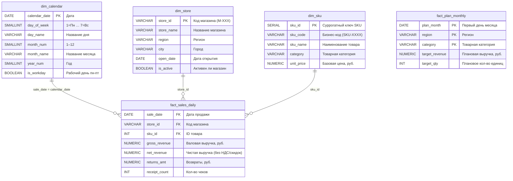

# Модель данных витрины продаж МегаБайт

## ER-диаграмма



> **Схема:** модифицированная «снежинка» — два факта разной гранулярности связаны через общие атрибуты (region, category), а не через FK напрямую.

---

## Таблицы фактов

### `mart.fact_sales_daily` — Дневные продажи

| Атрибут | Тип | Описание |
|---------|-----|----------|
| `sale_date` | DATE | Дата транзакции |
| `store_id` | VARCHAR(8) | FK → dim_store |
| `sku_id` | INT | FK → dim_sku |
| `gross_revenue` | NUMERIC(12,2) | Валовая выручка (до скидок и НДС) |
| `net_revenue` | NUMERIC(12,2) | Чистая выручка (база для KPI) |
| `returns_amt` | NUMERIC(12,2) | Сумма возвратов за день |
| `receipt_count` | INT | Количество чеков |

**Гранулярность:** один ряд = один день × один магазин × один SKU.  
**Источник:** POS-система (реплика PostgreSQL), ~45 тыс. чеков/день по сети.  
**Особенность:** магазины M-104, M-217, M-089 работают на отдельном POS-формате — их данные требуют дополнительной нормализации перед загрузкой.

---

### `mart.fact_plan_monthly` — Месячный план продаж

| Атрибут | Тип | Описание |
|---------|-----|----------|
| `plan_month` | DATE | Первый день месяца (e.g. 2024-03-01) |
| `region` | VARCHAR(60) | Регион (совпадает с dim_store.region) |
| `category` | VARCHAR(60) | Категория (совпадает с dim_sku.category) |
| `target_revenue` | NUMERIC(14,2) | Плановая выручка на месяц, руб. |
| `target_qty` | INT | Плановое количество единиц |

**Гранулярность:** один ряд = один месяц × один регион × одна категория.  
**Источник:** Excel-файлы от коммерческого директора (нестабильный формат), загрузка по MERGE.

---

## Таблицы измерений

### `mart.dim_store` — Справочник магазинов

| Атрибут | Тип | Описание |
|---------|-----|----------|
| `store_id` | VARCHAR(8) PK | Код магазина (M-104, M-217 …) |
| `store_name` | VARCHAR(120) | Полное название |
| `region` | VARCHAR(60) | Регион — ключ связи с fact_plan_monthly |
| `city` | VARCHAR(60) | Город |
| `open_date` | DATE | Дата открытия магазина |
| `is_active` | BOOLEAN | FALSE для закрытых/приостановленных |

**SCD Type 1** — атрибуты перезаписываются. Флаг `is_active` обновляется немедленно при закрытии магазина.

---

### `mart.dim_sku` — Справочник товаров

| Атрибут | Тип | Описание |
|---------|-----|----------|
| `sku_id` | SERIAL PK | Суррогатный ключ |
| `sku_code` | VARCHAR(20) | Бизнес-код (SKU-0011 …) |
| `sku_name` | VARCHAR(120) | Наименование товара |
| `category` | VARCHAR(60) | Категория — ключ связи с fact_plan_monthly |
| `unit_price` | NUMERIC(10,2) | Базовая цена (справочно) |

**Источник:** 1С-Предприятие. ~15 тыс. активных SKU.

---

### `mart.dim_calendar` — Календарь

| Атрибут | Тип | Описание |
|---------|-----|----------|
| `calendar_date` | DATE PK | Дата |
| `day_of_week` | SMALLINT | 1=Пн … 7=Вс (ISO) |
| `is_workday` | BOOLEAN | TRUE для пн-пт (без праздников в стартовом наборе) |
| `month_num` | SMALLINT | 1–12 |
| `year_num` | SMALLINT | Год |

**Важно:** `is_workday` в стартовом наборе считается как пн-пт без учёта российских праздников. В продакшене необходимо загрузить производственный календарь РФ для корректного расчёта `period_progress_pct`.

---

## Связи между таблицами

```
fact_sales_daily.sale_date  → dim_calendar.calendar_date
fact_sales_daily.store_id   → dim_store.store_id
fact_sales_daily.sku_id     → dim_sku.sku_id

fact_plan_monthly связывается с фактом НЕ через FK, а через атрибуты:
  fact_sales_daily → dim_store.region   == fact_plan_monthly.region
  fact_sales_daily → dim_sku.category   == fact_plan_monthly.category
  DATE_TRUNC('month', sale_date)        == fact_plan_monthly.plan_month
```

## Разница гранулярностей и шаг агрегации

```
fact_sales_daily                         fact_plan_monthly
(день × магазин × SKU)       →→→        (месяц × регион × категория)

Шаг 1: sale_date → DATE_TRUNC('month', sale_date)   [день → месяц]
Шаг 2: store_id  → dim_store.region                  [магазин → регион]
Шаг 3: sku_id    → dim_sku.category                  [SKU → категория]
Шаг 4: FULL OUTER JOIN по (month, region, category)
```

FULL OUTER JOIN сохраняет строки плана без продаж (новые регионы/категории) и строки продаж без плана (например, нераспланированная категория).
