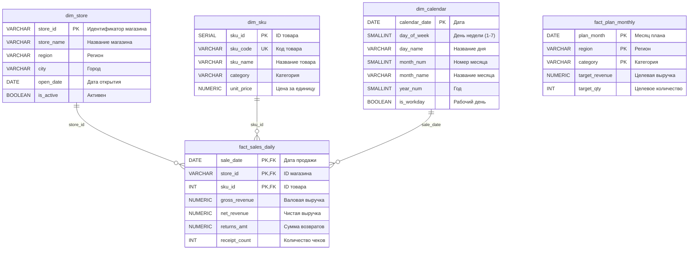

# Модель данных витрины продаж МегаБайт

## Обзор

Модель данных представляет собой классическую схему "звезда" (Star Schema) для аналитической витрины продаж розничной сети МегаБайт.

## Диаграмма модели данных



## Описание таблиц

### Измерения (Dimensions)

#### 1. dim_store - Справочник магазинов
Содержит информацию о магазинах сети МегаБайт.

**Ключевые поля:**
- `store_id` (PK) - уникальный идентификатор магазина (формат: M-XXX)
- `store_name` - название магазина
- `region` - регион расположения
- `city` - город
- `open_date` - дата открытия магазина
- `is_active` - флаг активности магазина

**Данные:** 5 магазинов в разных регионах России

#### 2. dim_sku - Справочник товаров
Содержит информацию о товарах (SKU - Stock Keeping Unit).

**Ключевые поля:**
- `sku_id` (PK) - суррогатный ключ (автоинкремент)
- `sku_code` (UK) - уникальный код товара (формат: SKU-XXXX)
- `sku_name` - название товара
- `category` - категория товара
- `unit_price` - цена за единицу товара

**Данные:** 8 товаров из разных категорий (молоко, хлеб, снеки и т.д.)

#### 3. dim_calendar - Календарь
Календарное измерение для временного анализа.

**Ключевые поля:**
- `calendar_date` (PK) - дата
- `day_of_week` - день недели (1=Пн, 7=Вс)
- `day_name` - название дня недели
- `month_num` - номер месяца
- `month_name` - название месяца
- `year_num` - год
- `is_workday` - флаг рабочего дня

**Данные:** 60 дней с 2024-03-01 по 2024-04-29

### Факты (Facts)

#### 4. fact_sales_daily - Ежедневные продажи
Таблица фактов с ежедневными продажами по магазинам и товарам.

**Ключевые поля:**
- `sale_date` (PK, FK) - дата продажи → dim_calendar
- `store_id` (PK, FK) - идентификатор магазина → dim_store
- `sku_id` (PK, FK) - идентификатор товара → dim_sku
- `gross_revenue` - валовая выручка
- `net_revenue` - чистая выручка (после вычета возвратов и скидок)
- `returns_amt` - сумма возвратов
- `receipt_count` - количество чеков

**Гранулярность:** день × магазин × товар

**Связи:**
- Связь с dim_calendar по sale_date
- Связь с dim_store по store_id
- Связь с dim_sku по sku_id

#### 5. fact_plan_monthly - Месячные планы
Таблица фактов с плановыми показателями по месяцам, регионам и категориям.

**Ключевые поля:**
- `plan_month` (PK) - месяц плана (первый день месяца)
- `region` (PK) - регион
- `category` (PK) - категория товаров
- `target_revenue` - целевая выручка
- `target_qty` - целевое количество продаж

**Гранулярность:** месяц × регион × категория

**Примечание:** Эта таблица не имеет прямых FK-связей с измерениями, связи осуществляются через значения полей region и category.

## Тип схемы

**Star Schema (Схема "звезда")**

Модель реализует классическую схему "звезда":
- В центре находится таблица фактов `fact_sales_daily`
- Вокруг неё расположены таблицы измерений (dim_store, dim_sku, dim_calendar)
- Таблица `fact_plan_monthly` является дополнительной таблицей фактов для плановых показателей

## Основные метрики

Из модели можно получить следующие метрики:

1. **Выручка:**
   - Валовая выручка (gross_revenue)
   - Чистая выручка (net_revenue)
   - Сумма возвратов (returns_amt)

2. **Объёмы:**
   - Количество чеков (receipt_count)
   - Целевое количество продаж (target_qty)

3. **Аналитические разрезы:**
   - По времени (день, месяц, год, день недели)
   - По магазинам (магазин, регион, город)
   - По товарам (товар, категория)

## Примеры аналитических запросов

### 1. Продажи по регионам за период
```sql
SELECT 
    s.region,
    SUM(f.net_revenue) as total_revenue,
    SUM(f.receipt_count) as total_receipts
FROM mart.fact_sales_daily f
JOIN mart.dim_store s ON f.store_id = s.store_id
JOIN mart.dim_calendar c ON f.sale_date = c.calendar_date
WHERE c.calendar_date BETWEEN '2024-03-01' AND '2024-03-31'
GROUP BY s.region
ORDER BY total_revenue DESC;
```

### 2. Топ товаров по выручке
```sql
SELECT 
    sk.sku_name,
    sk.category,
    SUM(f.net_revenue) as total_revenue,
    SUM(f.receipt_count) as total_receipts
FROM mart.fact_sales_daily f
JOIN mart.dim_sku sk ON f.sku_id = sk.sku_id
GROUP BY sk.sku_name, sk.category
ORDER BY total_revenue DESC
LIMIT 10;
```

### 3. Сравнение факта с планом
```sql
SELECT 
    p.region,
    p.category,
    p.target_revenue,
    COALESCE(SUM(f.net_revenue), 0) as actual_revenue,
    ROUND(100.0 * COALESCE(SUM(f.net_revenue), 0) / p.target_revenue, 2) as achievement_pct
FROM mart.fact_plan_monthly p
LEFT JOIN mart.dim_store s ON p.region = s.region
LEFT JOIN mart.fact_sales_daily f ON f.store_id = s.store_id
LEFT JOIN mart.dim_sku sk ON f.sku_id = sk.sku_id AND sk.category = p.category
LEFT JOIN mart.dim_calendar c ON f.sale_date = c.calendar_date
WHERE p.plan_month = '2024-03-01'
  AND DATE_TRUNC('month', c.calendar_date) = p.plan_month
GROUP BY p.region, p.category, p.target_revenue
ORDER BY p.region, p.category;
```

### 4. Анализ продаж по дням недели
```sql
SELECT 
    c.day_name,
    c.is_workday,
    COUNT(DISTINCT f.sale_date) as days_count,
    SUM(f.net_revenue) as total_revenue,
    AVG(f.net_revenue) as avg_revenue_per_day
FROM mart.fact_sales_daily f
JOIN mart.dim_calendar c ON f.sale_date = c.calendar_date
GROUP BY c.day_of_week, c.day_name, c.is_workday
ORDER BY c.day_of_week;
```

## Особенности реализации

1. **Составной первичный ключ** в fact_sales_daily обеспечивает уникальность на уровне день-магазин-товар
2. **Календарное измерение** предзаполнено на 60 дней для обеспечения полноты временных рядов
3. **Суррогатный ключ** в dim_sku (sku_id) отделён от бизнес-ключа (sku_code)
4. **Денормализация** в fact_plan_monthly (region, category хранятся как значения, а не FK) упрощает запросы планирования
5. **Метрики возвратов** включены в таблицу фактов для анализа качества продаж

## Потенциальные расширения модели

1. Добавление измерения клиентов (dim_customer)
2. Добавление измерения промо-акций (dim_promotion)
3. Детализация продаж до уровня чека (fact_sales_transaction)
4. Добавление измерения времени суток для внутридневного анализа
5. Добавление SCD Type 2 для отслеживания изменений цен в dim_sku
