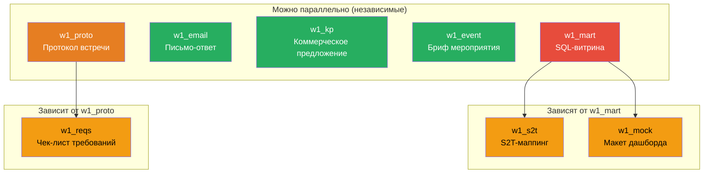

# Карта зависимостей задач Недели 1

## Визуальная карта

## Матрица зависимостей

| Задача | Зависит от | Что использует из зависимости | Можно начать сразу? |
|--------|-----------|-------------------------------|---------------------|
| **w1_mart** | — | DDL из стартера | ДА |
| **w1_proto** | — | Транскрипт из стартера | ДА |
| **w1_email** | — | Кейс в самом задании | ДА |
| **w1_kp** | — | Скелет из стартера | ДА |
| **w1_event** | — | Бриф из стартера | ДА |
| **w1_s2t** | **w1_mart** | Имена таблиц, колонок, типы данных, метрики витрины | НЕТ — сначала mart |
| **w1_mock** | **w1_mart** | Метрики витрины для KPI-карточек, гранулярность | НЕТ — сначала mart |
| **w1_reqs** | **w1_proto** | Обсуждённые вопросы, open issues, решения из протокола | НЕТ — сначала proto |

## Оптимальный порядок выполнения (3 человека)

### Волна 1 (параллельно, ~60 мин)

| Участник 1 (Data) | Участник 2 (PM) | Участник 3 (BI/Design) |
|--------------------|-----------------|------------------------|
| **w1_mart** — SQL-витрина | **w1_proto** — протокол встречи | **w1_event** — бриф мероприятия |

### Волна 2 (параллельно, ~45 мин)

| Участник 1 (Data) | Участник 2 (PM) | Участник 3 (BI/Design) |
|--------------------|-----------------|------------------------|
| **w1_s2t** — S2T маппинг (ждёт mart) | **w1_reqs** — чек-лист (ждёт proto) | **w1_kp** — КП |

### Волна 3 (параллельно, ~45 мин)

| Участник 1 (Data) | Участник 2 (PM) | Участник 3 (BI/Design) |
|--------------------|-----------------|------------------------|
| _(ревью чужих задач)_ | **w1_email** — письмо-ответ | **w1_mock** — макет дашборда (ждёт mart) |

**Итого:** 3 волны × ~60 мин ≈ **3 часа** на все 8 задач при параллельной работе.

## Цепочки между неделями

Каждая задача W1 — начало цепочки, которая продолжается в W2-W4:

| Цепочка | W1 | W2 | W3 | W4 |
|---------|----|----|----|----|
| A. Витрина | **mart** | harness | — | — |
| B. Дашборд | **mock** | dashux | states | — |
| C. Sales Kit | **kp** | pitch | objkit | demo |
| D. Управление | **email** | batch | planfact | — |
| E. Аналитика | **s2t** | profile | — | — |
| F. Маркетинг | **event** | follow | digest | landing |
| G. Обследование | **proto** → **reqs** | bridge | integ | disc |

**Вывод:** Качество W1-артефактов критично — каждый переиспользуется в следующих неделях. Ошибка в w1_mart каскадирует в w1_s2t, w1_mock, w2_harness.
